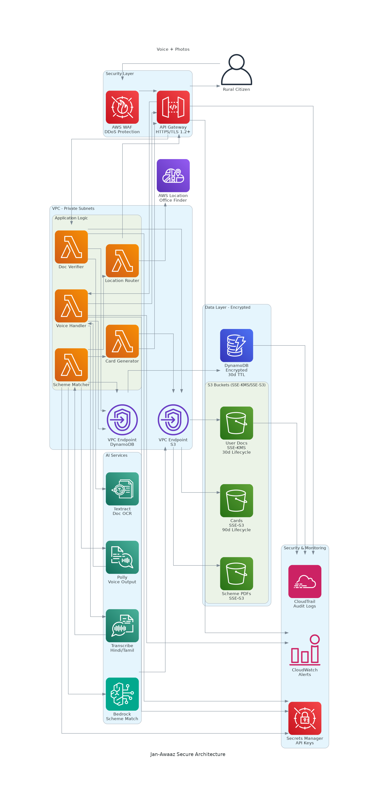
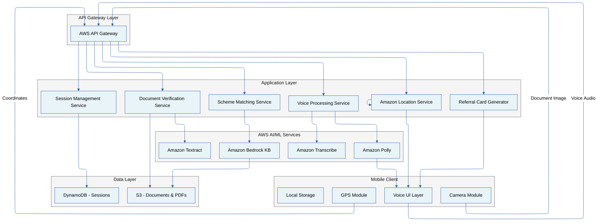
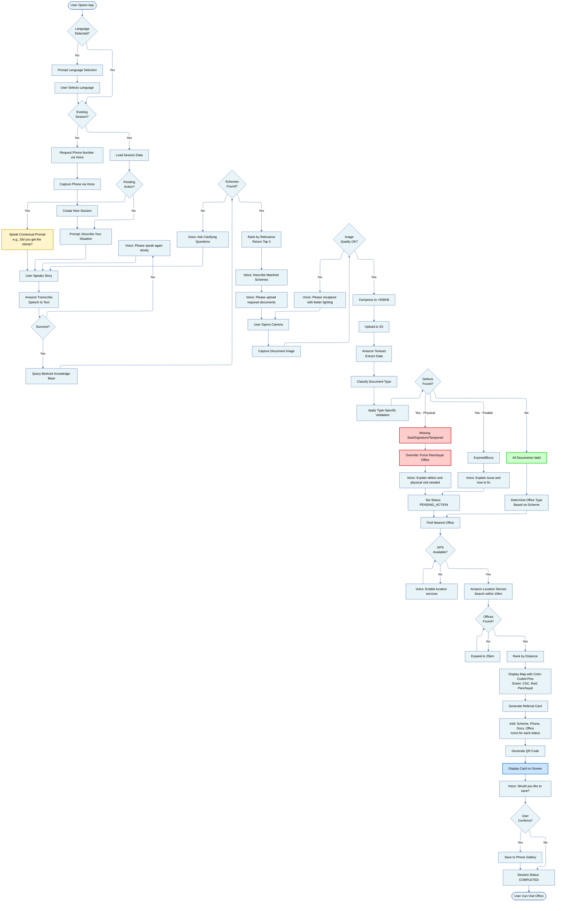

# Design Document: Jan-Awaaz

## Overview

Jan-Awaaz is a voice-first mobile application that bridges the gap between rural Indian citizens and government schemes through intelligent voice interaction, document verification, and smart routing. The system architecture is built on AWS services to provide scalable, low-latency voice processing, document analysis, and knowledge-based scheme matching.

The design follows a mobile-first, voice-centric approach where 90% of user interaction happens through speech. The system uses Amazon Transcribe for multi-language speech-to-text, Amazon Polly for natural voice responses, Amazon Textract for document verification, and Amazon Bedrock Knowledge Base for accurate scheme matching. A critical design principle is "no hallucination" - the system only returns schemes that exist in verified government PDF documents.

Key architectural decisions:
- **Stateful session management** using phone numbers as identifiers (no email/password)
- **Proactive context awareness** that remembers user state and prompts intelligently on return visits
- **Smart routing logic** that connects document defects to physical office requirements
- **Icon-heavy visual design** for illiterate users with minimal text dependency

## Architecture

### High-Level Architecture



The architecture diagram above shows the complete AWS infrastructure for Jan-Awaaz:

- **User Layer**: Rural citizens interact via mobile devices with voice and camera inputs
- **API Gateway**: Central entry point for all client requests
- **AI Services**: Amazon Transcribe (speech-to-text), Polly (text-to-speech), Bedrock (scheme matching), and Textract (document OCR)
- **Application Logic**: Lambda functions handling voice processing, document verification, scheme matching, location routing, and card generation
- **Data Layer**: DynamoDB for session management, S3 buckets for scheme PDFs, user documents, and referral cards
- **Location Service**: AWS Location Service for finding nearest government offices



### Component Interaction Flow

**User Journey Flowchart:**



**Voice Interaction Flow:**
1. User speaks into mobile microphone
2. Audio streamed to Voice Processing Service via API Gateway
3. Amazon Transcribe converts speech to text (language-specific model)
4. Text sent to Scheme Matching Service
5. Bedrock Knowledge Base queries PDF documents for matching schemes
6. Results formatted and sent to Amazon Polly for speech synthesis
7. Voice response streamed back to mobile client

**Document Verification Flow:**
1. User captures document photo via camera
2. Image compressed and uploaded to Document Verification Service
3. Amazon Textract extracts text, dates, seals, signatures
4. Validation rules applied based on document type
5. Defects identified (missing seal, expired date, etc.)
6. If defects found, Location Routing Service overrides destination to Panchayat office
7. Results returned as structured data and voice feedback

**Session Restoration Flow:**
1. User opens app, phone number detected
2. Session Management Service queries DynamoDB for existing session
3. If session exists with PENDING_ACTION status, system immediately speaks contextual prompt
4. Previous scheme matches, document status, and referral cards loaded
5. User can continue from where they left off

## Components and Interfaces

### 1. Voice Processing Service

**Responsibilities:**
- Capture and stream audio from mobile microphone
- Route audio to Amazon Transcribe with language parameter
- Receive transcribed text and forward to downstream services
- Generate voice responses using Amazon Polly
- Handle audio compression for low bandwidth

**Interfaces:**

```typescript
interface VoiceProcessingService {
  // Capture voice input and return transcribed text
  transcribeVoice(audioStream: AudioStream, language: Language): Promise<TranscribedText>
  
  // Generate voice output from text
  synthesizeSpeech(text: string, language: Language): Promise<AudioStream>
  
  // Handle segmented audio for long inputs
  transcribeSegmented(audioStream: AudioStream, language: Language): Promise<TranscribedText[]>
}

interface AudioStream {
  data: Buffer
  format: 'wav' | 'mp3' | 'ogg'
  sampleRate: number
}

interface TranscribedText {
  text: string
  confidence: number
  language: Language
  timestamp: Date
}

type Language = 'hi-IN' | 'ta-IN' | 'te-IN' | 'kn-IN' | 'ml-IN' | 'mr-IN' | 'bn-IN' | 'gu-IN' | 'pa-IN' | 'or-IN'
```

**Key Design Decisions:**
- Use streaming transcription for real-time feedback (<5 second latency)
- Implement automatic language detection fallback if user's device language not set
- Compress audio using Opus codec for bandwidth optimization
- Cache Polly responses for common phrases to reduce latency

### 2. Document Verification Service

**Responsibilities:**
- Receive document images from mobile camera
- Classify document type automatically (Aadhaar, Income Certificate, Land Patta)
- Extract structured data using Amazon Textract
- Apply validation rules based on document type
- Identify defects (missing seal, expired date, blurry image)
- Trigger smart routing logic when physical corrections needed

**Interfaces:**

```typescript
interface DocumentVerificationService {
  // Upload and verify document
  verifyDocument(image: DocumentImage): Promise<VerificationResult>
  
  // Classify document type
  classifyDocument(image: DocumentImage): Promise<DocumentType>
  
  // Extract structured data
  extractData(image: DocumentImage, type: DocumentType): Promise<ExtractedData>
}

interface DocumentImage {
  data: Buffer
  format: 'jpg' | 'png'
  size: number
  captureTimestamp: Date
}

interface VerificationResult {
  documentType: DocumentType
  isValid: boolean
  defects: Defect[]
  extractedData: ExtractedData
  requiresPhysicalVisit: boolean
}

interface Defect {
  type: 'MISSING_SEAL' | 'MISSING_SIGNATURE' | 'EXPIRED' | 'BLURRY' | 'TAMPERED'
  description: string
  severity: 'HIGH' | 'MEDIUM' | 'LOW'
}

type DocumentType = 'AADHAAR' | 'INCOME_CERTIFICATE' | 'LAND_PATTA' | 'UNKNOWN'

interface ExtractedData {
  fields: Record<string, string>
  confidence: number
}
```

**Validation Rules:**

**Aadhaar Card:**
- 12-digit number format validation
- Name and DOB extraction
- Photo quality check
- Hologram/security feature detection

**Income Certificate:**
- Government seal presence check
- Issuing authority signature verification
- Annual income amount extraction
- Validity date check (typically 6 months)

**Land Patta:**
- Survey number extraction
- Area measurement validation
- Owner name matching
- Issuing authority verification

**Key Design Decisions:**
- Compress images to <500KB before upload while maintaining 300 DPI for Textract
- Use Textract's AnalyzeDocument API with FORMS and TABLES analysis
- Implement client-side blur detection before upload to save API costs
- Store original images in S3 with 30-day lifecycle policy

### 3. Scheme Matching Service

**Responsibilities:**
- Receive user's transcribed story/situation
- Query Amazon Bedrock Knowledge Base with semantic search
- Rank matching schemes by relevance
- Extract eligibility criteria, required documents, and application process
- Ensure no hallucinated schemes (strict source verification)

**Interfaces:**

```typescript
interface SchemeMatchingService {
  // Find schemes matching user's situation
  findMatchingSchemes(userStory: string, userContext: UserContext): Promise<SchemeMatch[]>
  
  // Get detailed scheme information
  getSchemeDetails(schemeId: string): Promise<SchemeDetails>
  
  // Validate scheme exists in knowledge base
  validateScheme(schemeName: string): Promise<boolean>
}

interface UserContext {
  phoneNumber: string
  language: Language
  location: GPSCoordinates
  previousSchemes: string[]
}

interface SchemeMatch {
  schemeId: string
  schemeName: string
  relevanceScore: number
  eligibilityCriteria: string[]
  requiredDocuments: DocumentType[]
  applicationProcess: ApplicationProcess
  sourceDocument: string
}

interface ApplicationProcess {
  type: 'ONLINE' | 'PHYSICAL' | 'HYBRID'
  steps: string[]
  estimatedTime: string
  fees: number
}

interface SchemeDetails {
  schemeId: string
  schemeName: string
  description: string
  eligibility: string[]
  benefits: string[]
  documents: DocumentType[]
  applicationProcess: ApplicationProcess
  contactInfo: ContactInfo
}
```

**Knowledge Base Configuration:**
- Use Amazon Bedrock with Titan Embeddings for semantic search
- Index government scheme PDFs with metadata (state, category, last updated)
- Implement retrieval with source attribution to prevent hallucination
- Set confidence threshold at 0.7 for scheme matches
- Return top 3 matches ranked by relevance score

**Key Design Decisions:**
- Use RAG (Retrieval Augmented Generation) pattern with strict source citation
- Implement query expansion to handle colloquial descriptions ("my husband died" → "widow pension")
- Cache frequent queries to reduce Bedrock API calls
- Maintain separate knowledge bases per state for state-specific schemes

### 4. Session Management Service

**Responsibilities:**
- Create and retrieve sessions using phone number as identifier
- Store session state (scheme matches, document status, action items)
- Implement proactive context awareness for returning users
- Track PENDING_ACTION status for smart nudges
- Archive inactive sessions after 30 days

**Interfaces:**

```typescript
interface SessionManagementService {
  // Create or retrieve session
  getOrCreateSession(phoneNumber: string): Promise<Session>
  
  // Update session state
  updateSession(sessionId: string, updates: Partial<SessionState>): Promise<void>
  
  // Check for pending actions
  getPendingActions(sessionId: string): Promise<PendingAction[]>
  
  // Archive old sessions
  archiveSession(sessionId: string): Promise<void>
}

interface Session {
  sessionId: string
  phoneNumber: string
  language: Language
  createdAt: Date
  lastAccessedAt: Date
  state: SessionState
}

interface SessionState {
  currentStep: 'VOICE_INPUT' | 'DOCUMENT_UPLOAD' | 'SCHEME_MATCH' | 'VERIFICATION' | 'REFERRAL_GENERATED'
  schemeMatches: SchemeMatch[]
  documentVerifications: VerificationResult[]
  referralCards: ReferralCard[]
  pendingActions: PendingAction[]
  status: 'ACTIVE' | 'PENDING_ACTION' | 'COMPLETED' | 'ARCHIVED'
}

interface PendingAction {
  actionType: 'GET_STAMP' | 'RENEW_DOCUMENT' | 'VISIT_OFFICE' | 'UPLOAD_DOCUMENT'
  description: string
  dueDate?: Date
  contextualPrompt: string
}
```

**DynamoDB Schema:**

```
Table: Jan-Awaaz-sessions
Partition Key: phoneNumber (String)
Sort Key: sessionId (String)
Attributes:
  - language (String)
  - createdAt (Number - Unix timestamp)
  - lastAccessedAt (Number - Unix timestamp)
  - state (Map)
  - ttl (Number - for automatic archival)

GSI: SessionsByStatus
Partition Key: status (String)
Sort Key: lastAccessedAt (Number)
```

**Key Design Decisions:**
- Use phone number as partition key for fast lookups
- Implement TTL for automatic archival after 30 days
- Store session state as JSON document for flexibility
- Use DynamoDB Streams to trigger proactive notifications (future enhancement)

### 5. Location Routing Service

**Responsibilities:**
- Determine correct office type based on scheme and document status
- Override destination to Panchayat office if document defects require physical correction
- Find nearest offices using GPS coordinates
- Display color-coded pins (Green for CSC, Red for Panchayat)
- Calculate distance and provide directions

**Interfaces:**

```typescript
interface LocationRoutingService {
  // Determine correct office type
  determineOfficeType(scheme: SchemeMatch, verificationResult: VerificationResult): Promise<OfficeType>
  
  // Find nearest offices
  findNearestOffices(location: GPSCoordinates, officeType: OfficeType, radiusKm: number): Promise<Office[]>
  
  // Get directions
  getDirections(from: GPSCoordinates, to: Office): Promise<Directions>
}

type OfficeType = 'CSC' | 'PANCHAYAT' | 'DISTRICT_OFFICE' | 'TALUK_OFFICE'

interface Office {
  officeId: string
  name: string
  type: OfficeType
  location: GPSCoordinates
  address: string
  contactNumber: string
  workingHours: string
  distanceKm: number
}

interface GPSCoordinates {
  latitude: number
  longitude: number
}

interface Directions {
  distanceKm: number
  estimatedTimeMinutes: number
  steps: string[]
  mapUrl: string
}
```

**Smart Routing Logic:**

```typescript
function determineOfficeType(
  scheme: SchemeMatch, 
  verificationResult: VerificationResult
): OfficeType {
  // Priority 1: Document defects requiring physical correction
  if (verificationResult.requiresPhysicalVisit) {
    const physicalDefects = ['MISSING_SEAL', 'MISSING_SIGNATURE', 'TAMPERED']
    const hasPhysicalDefect = verificationResult.defects.some(
      d => physicalDefects.includes(d.type)
    )
    if (hasPhysicalDefect) {
      return 'PANCHAYAT' // Force physical visit
    }
  }
  
  // Priority 2: Scheme application process type
  if (scheme.applicationProcess.type === 'ONLINE') {
    return 'CSC'
  } else if (scheme.applicationProcess.type === 'PHYSICAL') {
    return 'PANCHAYAT'
  } else {
    // HYBRID - prefer CSC if documents are valid
    return verificationResult.isValid ? 'CSC' : 'PANCHAYAT'
  }
}
```

**Key Design Decisions:**
- Use Amazon Location Service with Esri or HERE data providers for high-accuracy Indian government office locations
- Maintain office database in DynamoDB with geospatial indexing
- Implement 10km radius search with fallback to 25km if no results
- Cache office locations for 24 hours to reduce API calls
- Use Place Index for searching offices by type and location
- Use Route Calculator for distance and directions

### 6. Referral Card Generator

**Responsibilities:**
- Generate visual referral card (Parchee) with scheme details
- Use heavy iconography for illiterate users
- Include QR code for CSC operator scanning
- Allow saving to phone gallery
- Display validation status with color-coded icons

**Interfaces:**

```typescript
interface ReferralCardGenerator {
  // Generate referral card
  generateCard(session: Session, scheme: SchemeMatch, office: Office): Promise<ReferralCard>
  
  // Save card to gallery
  saveToGallery(card: ReferralCard): Promise<boolean>
}

interface ReferralCard {
  cardId: string
  referenceNumber: string
  timestamp: Date
  phoneNumber: string
  schemeName: string
  eligibilityStatus: 'ELIGIBLE' | 'PENDING_DOCS' | 'NEEDS_CORRECTION'
  requiredDocuments: DocumentStatus[]
  officeDetails: Office
  qrCode: string
  imageUrl: string
}

interface DocumentStatus {
  documentType: DocumentType
  status: 'VALID' | 'INVALID' | 'MISSING' | 'EXPIRED'
  icon: IconType
  message: string
}

type IconType = 'GREEN_CHECK' | 'RED_CROSS' | 'YELLOW_WARNING' | 'BLUE_INFO'
```

**Visual Design Principles:**
- Large icons (minimum 48x48px) for each document status
- Color coding: Green (valid), Red (invalid), Yellow (warning), Blue (info)
- Minimal text, maximum 10 words per section
- High contrast (black text on white background)
- QR code for machine reading by CSC operators
- Reference number in large, bold font

**Key Design Decisions:**
- Generate cards as PNG images using Canvas API or similar
- Include QR code with encrypted session data for CSC operator access
- Store generated cards in S3 with 90-day lifecycle
- Use system fonts for maximum compatibility

## Security Architecture

Jan-Awaaz handles sensitive citizen data including Aadhaar cards, income certificates, and personal information. The security architecture implements defense-in-depth with encryption, access controls, and compliance measures.

### Encryption Strategy

**Data at Rest:**
- **S3 Buckets**: Enable server-side encryption (SSE-S3 or SSE-KMS)
  - User Documents bucket: SSE-KMS with customer-managed keys for audit trail
  - Scheme PDFs bucket: SSE-S3 (public data, lower security requirements)
  - Referral Cards bucket: SSE-S3 with 90-day lifecycle policy
- **DynamoDB**: Enable encryption at rest using AWS-managed keys
- **Lambda Environment Variables**: Encrypt sensitive configuration (API keys, secrets) using AWS Secrets Manager

**Data in Transit:**
- **API Gateway**: Enforce HTTPS only with TLS 1.2+ (disable HTTP)
- **S3 Pre-signed URLs**: Use HTTPS for document uploads/downloads
- **Internal Communication**: Use VPC endpoints for Lambda-to-S3 and Lambda-to-DynamoDB traffic (no internet exposure)

### Access Control and IAM

**Principle of Least Privilege:**

```typescript
// Lambda Execution Roles (example)
interface LambdaIAMPolicies {
  VoiceHandlerRole: {
    transcribe: ['transcribe:StartStreamTranscription'],
    polly: ['polly:SynthesizeSpeech'],
    dynamodb: ['dynamodb:GetItem', 'dynamodb:PutItem'],
    s3: [] // No S3 access needed
  },
  
  DocumentVerifierRole: {
    textract: ['textract:AnalyzeDocument'],
    s3: [
      's3:PutObject on user-documents bucket',
      's3:GetObject on user-documents bucket'
    ],
    dynamodb: ['dynamodb:UpdateItem']
  },
  
  SchemeMatcherRole: {
    bedrock: ['bedrock:InvokeModel', 'bedrock:Retrieve'],
    s3: ['s3:GetObject on scheme-pdfs bucket (read-only)'],
    dynamodb: ['dynamodb:GetItem', 'dynamodb:UpdateItem']
  }
}
```

**S3 Bucket Policies:**
- Block all public access on user-documents and referral-cards buckets
- Enable versioning on user-documents bucket for audit trail
- Restrict access to specific Lambda execution roles only
- Enable S3 Access Logging for compliance auditing

**API Gateway Security:**
- Implement API key authentication for mobile clients
- Enable AWS WAF for DDoS protection and rate limiting
- Configure throttling: 1000 requests/second per user (burst: 2000)
- Use resource policies to restrict access to specific IP ranges (optional for CSC operators)

### PII Protection and Data Privacy

**Aadhaar Compliance:**
- **Masking**: Never log full Aadhaar numbers (mask middle 8 digits: XXXX-XXXX-1234)
- **Storage Limitation**: Store Aadhaar images for maximum 30 days, then auto-delete
- **Access Logging**: Enable CloudTrail to audit all access to Aadhaar documents
- **Consent**: Capture explicit user consent before processing Aadhaar (voice confirmation)

**Phone Number as Identifier:**
- Hash phone numbers in logs using SHA-256
- Implement rate limiting per phone number (max 10 sessions/day)
- No email/password storage (reduces attack surface)

**Data Retention Policies:**
```typescript
interface DataRetentionPolicy {
  userDocuments: {
    retention: '30 days',
    action: 'Automatic deletion via S3 lifecycle policy'
  },
  referralCards: {
    retention: '90 days',
    action: 'Automatic deletion via S3 lifecycle policy'
  },
  sessionData: {
    retention: '30 days',
    action: 'DynamoDB TTL-based deletion'
  },
  schemePDFs: {
    retention: 'Indefinite',
    action: 'Manual review and update'
  },
  auditLogs: {
    retention: '1 year',
    action: 'CloudTrail logs archived to S3 Glacier'
  }
}
```

### Network Security

**VPC Configuration:**
- Deploy Lambda functions in private subnets (no internet gateway)
- Use VPC endpoints for AWS service access (S3, DynamoDB, Transcribe, Polly, Textract, Bedrock)
- Configure security groups to allow only necessary traffic
- Enable VPC Flow Logs for network monitoring

**API Gateway:**
- Deploy as regional endpoint (not edge-optimized) for data residency
- Enable CloudWatch Logs for all API requests
- Configure CORS policies to restrict mobile app origins only

### Compliance and Auditing

**Data Residency:**
- Deploy all resources in AWS Mumbai (ap-south-1) region
- Ensure no data replication to regions outside India
- Use region-specific Bedrock and Transcribe models

**Audit Logging:**
- Enable AWS CloudTrail for all API calls
- Log all S3 object access (GetObject, PutObject, DeleteObject)
- Enable DynamoDB Streams for session state changes
- Store audit logs in separate S3 bucket with 1-year retention

**Monitoring and Alerting:**
- CloudWatch Alarms for:
  - Unusual API Gateway traffic spikes (potential DDoS)
  - High error rates in Lambda functions
  - S3 bucket policy changes
  - IAM role modifications
- SNS notifications to security team for critical alerts

**Incident Response:**
- Automated Lambda function to revoke compromised API keys
- S3 Object Lock for audit logs (prevent tampering)
- Regular security reviews and penetration testing

### Authentication and Authorization

**Mobile Client Authentication:**
- API Gateway API keys for client identification
- Phone number verification via OTP (future enhancement)
- Session tokens stored in DynamoDB with 24-hour expiry

**CSC Operator Access:**
- Separate API endpoint with Cognito authentication
- QR code scanning to retrieve encrypted session data
- Audit log for all CSC operator actions

### Input Validation and Sanitization

**API Gateway Request Validation:**
- JSON schema validation for all API requests
- Maximum payload size: 5MB for document uploads
- Content-Type validation (audio/wav, image/jpeg, image/png only)

**Lambda Input Sanitization:**
- Validate phone number format (10 digits, Indian format)
- Sanitize user voice input before logging (remove PII)
- Validate GPS coordinates (within India bounding box)

**SQL Injection Prevention:**
- Use DynamoDB (NoSQL) to avoid SQL injection risks
- Parameterized queries for any future RDS integration

### Security Best Practices

**Secrets Management:**
- Store API keys, database credentials in AWS Secrets Manager
- Rotate secrets automatically every 90 days
- Never hardcode secrets in Lambda code or environment variables

**Dependency Management:**
- Regularly update Lambda runtime versions
- Scan dependencies for vulnerabilities using AWS Inspector
- Use Lambda Layers for shared dependencies (easier patching)

**Error Handling:**
- Never expose stack traces or internal errors to mobile clients
- Log detailed errors to CloudWatch for debugging
- Return generic error messages to users ("Something went wrong, please try again")

## Data Models

### Session Data Model

```typescript
interface SessionData {
  sessionId: string
  phoneNumber: string
  language: Language
  createdAt: Date
  lastAccessedAt: Date
  
  // Current state
  currentStep: WorkflowStep
  status: SessionStatus
  
  // User context
  userStory: string
  location: GPSCoordinates
  
  // Scheme matching results
  schemeMatches: SchemeMatch[]
  selectedScheme?: SchemeMatch
  
  // Document verification results
  documents: DocumentVerification[]
  
  // Pending actions
  pendingActions: PendingAction[]
  
  // Generated artifacts
  referralCards: ReferralCard[]
  
  // Routing information
  recommendedOffice?: Office
  
  // Metadata
  ttl: number // Unix timestamp for DynamoDB TTL
}

type WorkflowStep = 
  | 'LANGUAGE_SELECTION'
  | 'PHONE_NUMBER_CAPTURE'
  | 'VOICE_INPUT'
  | 'SCHEME_MATCHING'
  | 'DOCUMENT_UPLOAD'
  | 'DOCUMENT_VERIFICATION'
  | 'OFFICE_ROUTING'
  | 'REFERRAL_GENERATION'
  | 'COMPLETED'

type SessionStatus = 
  | 'ACTIVE'           // Currently in progress
  | 'PENDING_ACTION'   // Waiting for user action (get stamp, renew doc)
  | 'COMPLETED'        // Referral card generated
  | 'ARCHIVED'         // Inactive for 30+ days
```

### Document Verification Data Model

```typescript
interface DocumentVerification {
  verificationId: string
  documentType: DocumentType
  uploadedAt: Date
  imageUrl: string
  
  // Extraction results
  extractedData: Record<string, string>
  confidence: number
  
  // Validation results
  isValid: boolean
  defects: Defect[]
  requiresPhysicalVisit: boolean
  
  // Metadata
  processingTimeMs: number
  textractJobId: string
}
```

### Scheme Match Data Model

```typescript
interface SchemeMatchData {
  schemeId: string
  schemeName: string
  category: SchemeCategory
  state: string
  
  // Matching information
  relevanceScore: number
  matchedKeywords: string[]
  sourceDocument: string
  sourcePageNumbers: number[]
  
  // Scheme details
  description: string
  eligibilityCriteria: EligibilityCriterion[]
  requiredDocuments: DocumentRequirement[]
  benefits: Benefit[]
  
  // Application process
  applicationProcess: ApplicationProcess
  estimatedProcessingDays: number
  applicationFees: number
  
  // Contact information
  helplineNumber: string
  websiteUrl?: string
}

type SchemeCategory = 
  | 'PENSION'
  | 'AGRICULTURE'
  | 'EDUCATION'
  | 'HEALTH'
  | 'HOUSING'
  | 'EMPLOYMENT'
  | 'WOMEN_WELFARE'
  | 'DISABILITY'
  | 'OTHER'

interface EligibilityCriterion {
  criterion: string
  isMandatory: boolean
  verificationMethod: 'DOCUMENT' | 'DECLARATION' | 'FIELD_VISIT'
}

interface DocumentRequirement {
  documentType: DocumentType
  isMandatory: boolean
  validityPeriodMonths?: number
  specificRequirements: string[]
}

interface Benefit {
  benefitType: 'MONETARY' | 'SUBSIDY' | 'SERVICE' | 'CERTIFICATE'
  amount?: number
  frequency?: 'ONE_TIME' | 'MONTHLY' | 'QUARTERLY' | 'ANNUAL'
  description: string
}
```

### Office Location Data Model

```typescript
interface OfficeLocation {
  officeId: string
  name: string
  type: OfficeType
  
  // Location
  location: GPSCoordinates
  address: Address
  
  // Contact
  contactNumber: string
  email?: string
  
  // Operational details
  workingHours: WorkingHours
  workingDays: string[]
  holidays: Date[]
  
  // Services
  supportedSchemes: string[]
  hasOnlineSubmission: boolean
  hasDocumentScanning: boolean
  
  // Metadata
  lastUpdated: Date
  isActive: boolean
}

interface Address {
  line1: string
  line2?: string
  village?: string
  taluk: string
  district: string
  state: string
  pincode: string
}

interface WorkingHours {
  openTime: string  // "09:00"
  closeTime: string // "17:00"
  lunchBreak?: { start: string, end: string }
}
```

## Correctness Properties


A property is a characteristic or behavior that should hold true across all valid executions of a system - essentially, a formal statement about what the system should do. Properties serve as the bridge between human-readable specifications and machine-verifiable correctness guarantees.

### Property 1: Multi-Language Voice Input Support

*For any* supported Indian regional language (Hindi, Tamil, Telugu, Kannada, Malayalam, Marathi, Bengali, Gujarati, Punjabi, Odia), when a user speaks in that language, the system should successfully capture and accept the voice input.

**Validates: Requirements 1.1, 9.3**

### Property 2: Voice Transcription Latency

*For any* voice input, the transcription service should return text within 5 seconds of audio capture completion.

**Validates: Requirements 1.2, 13.1**

### Property 3: Segmented Audio Context Preservation

*For any* voice input longer than 60 seconds, when processed in segments, the complete transcription should preserve the full context and meaning without information loss.

**Validates: Requirements 1.3**

### Property 4: Noise Filtering Accuracy

*For any* clean voice sample, when background noise is added, the transcription accuracy should remain above 85% after noise filtering.

**Validates: Requirements 1.5**

### Property 5: Scheme Matcher Invocation

*For any* transcribed text received from voice input, the scheme matcher should query the Bedrock Knowledge Base.

**Validates: Requirements 2.1**

### Property 6: No Hallucinated Schemes (Source Verification)

*For any* scheme returned by the scheme matcher, that scheme must exist in the verified PDF documents in the knowledge base with exact name and eligibility criteria matching the source.

**Validates: Requirements 2.2, 12.1, 12.2, 12.4**

### Property 7: Scheme Ranking and Limiting

*For any* query that returns multiple scheme matches, the results should be ordered by relevance score (descending) and limited to the top 3 matches.

**Validates: Requirements 2.3**

### Property 8: Scheme Data Completeness

*For any* matched scheme, the system should extract and return all required fields: eligibility criteria, required documents, and application process details.

**Validates: Requirements 2.5**

### Property 9: Document Upload Reliability

*For any* document image captured via camera, the image should successfully upload to the verification service.

**Validates: Requirements 3.1**

### Property 10: Document Verification Latency and Completeness

*For any* document image processed by the verification service, the system should extract text, dates, seals, and signatures within 5 seconds.

**Validates: Requirements 3.2, 13.3**

### Property 11: Aadhaar Validation

*For any* document classified as Aadhaar, the verification service should validate the 12-digit number format and check for visible tampering indicators.

**Validates: Requirements 3.3**

### Property 12: Income Certificate Validation

*For any* document classified as Income Certificate, the verification service should check for required government seal and issuing authority signature.

**Validates: Requirements 3.4**

### Property 13: Document Expiration Detection

*For any* document with an extracted validity date, if the date is in the past, the system should mark the document as expired and notify the user via voice output with the specific expiration date.

**Validates: Requirements 3.5**

### Property 14: Document Defect Detection

*For any* document missing a required seal or signature, the system should identify the specific missing element and notify the user via voice output.

**Validates: Requirements 3.6**

### Property 15: Image Quality Validation

*For any* document image that is too blurry or dark (below quality threshold), the system should reject it and prompt the user to recapture with better lighting.

**Validates: Requirements 3.7**

### Property 16: Language Consistency (Input-Output Matching)

*For any* voice input in a specific language, all voice output responses should be generated in the same language.

**Validates: Requirements 4.1, 9.2**

### Property 17: Scheme Description Voice Output

*For any* scheme match found, the system should generate voice output describing the scheme.

**Validates: Requirements 4.2**

### Property 18: Verification Result Voice Output

*For any* completed document verification, the system should generate voice output confirming validity or explaining issues.

**Validates: Requirements 4.3**

### Property 19: Voice Synthesis Latency

*For any* text to be converted to speech, Amazon Polly should begin playback within 2 seconds of synthesis request.

**Validates: Requirements 4.4, 13.4**

### Property 20: Voice Output Replay

*For any* voice output that has been played, when the user requests a repeat, the system should replay the exact same audio content.

**Validates: Requirements 4.5**

### Property 21: Physical Scheme Office Routing

*For any* scheme with application process type "PHYSICAL", the office locator should identify the nearest Panchayat office and display a Red Pin on the map.

**Validates: Requirements 5.1**

### Property 22: Online Scheme Office Routing

*For any* scheme with application process type "ONLINE", the office locator should identify the nearest CSC and display a Green Pin on the map.

**Validates: Requirements 5.2**

### Property 23: Defect-to-Location Smart Routing

*For any* document verification that fails due to a missing physical attribute (seal, signature, or tampering), the system should automatically override the destination to Panchayat office (Red Pin) regardless of the scheme's default application type, and explain via voice output that a physical visit is required.

**Validates: Requirements 5.3**

### Property 24: GPS-Based Distance Calculation

*For any* user location with GPS coordinates, the system should calculate and return offices within 10 kilometers.

**Validates: Requirements 5.4**

### Property 25: Office Distance Ranking

*For any* query that returns multiple offices, the results should be sorted by distance in ascending order (nearest first).

**Validates: Requirements 5.5**

### Property 26: Referral Card Data Completeness

*For any* user matched to a scheme, the generated referral card should contain all required fields: scheme name, user phone number, required documents, and office location.

**Validates: Requirements 6.1**

### Property 27: Referral Card Iconography

*For any* referral card displayed, each document status should have an associated icon (Green Check for valid, Red Cross for invalid, Yellow Warning for issues, Blue Info for pending).

**Validates: Requirements 6.2**

### Property 28: Referral Card Visual Standards

*For any* referral card generated, text should have minimum font size of 16pt and icons should be minimum 48x48 pixels.

**Validates: Requirements 6.3**

### Property 29: Referral Card Save Functionality

*For any* referral card displayed, the user should be able to save it as an image to the phone gallery.

**Validates: Requirements 6.4**

### Property 30: Referral Card Operator View

*For any* referral card scanned or viewed by a CSC operator, the system should display all eligibility criteria and complete document checklist.

**Validates: Requirements 6.5**

### Property 31: Referral Card Metadata

*For any* referral card generated, it should include a timestamp and a unique reference number.

**Validates: Requirements 6.6**

### Property 32: Session Creation and Retrieval

*For any* phone number provided via voice input, the system should create a new session if none exists, or retrieve the existing session if one is associated with that number.

**Validates: Requirements 7.2**

### Property 33: Session Restoration

*For any* returning user with an existing session, the system should restore the previous session state including scheme matches, document verifications, and referral cards.

**Validates: Requirements 7.3**

### Property 34: Proactive Session Nudge

*For any* restored session with status "PENDING_ACTION", the system should immediately prompt the user with a contextual question via voice output without waiting for user input.

**Validates: Requirements 7.4**

### Property 35: Session Data Persistence

*For any* session created, the system should store all required data: scheme matches, document verification results, referral cards, and action status.

**Validates: Requirements 7.5**

### Property 36: Session Archival

*For any* session inactive for 30 days, the system should archive the data while retaining the phone number association.

**Validates: Requirements 7.6**

### Property 37: Image Compression with Readability

*For any* document image uploaded, the system should compress it to under 500KB while maintaining sufficient quality for text extraction (minimum 300 DPI equivalent).

**Validates: Requirements 8.1**

### Property 38: Audio Compression Optimization

*For any* voice output generated, the system should use compressed audio formats (Opus or AAC) optimized for mobile networks.

**Validates: Requirements 8.2**

### Property 39: Network Retry Logic

*For any* operation that fails due to poor network connectivity, the system should queue the operation and retry automatically when connectivity improves.

**Validates: Requirements 8.3**

### Property 40: Progress Indicator Display

*For any* data transfer operation in progress, the system should display a visual progress indicator.

**Validates: Requirements 8.5**

### Property 41: Language Detection and Prompting

*For any* system start, the system should either detect the user's preferred language from device settings or prompt for language selection.

**Validates: Requirements 9.1**

### Property 42: Referral Card Localization

*For any* referral card generated, all text should be displayed in the user's selected language.

**Validates: Requirements 9.4**

### Property 43: Dynamic Language Switching

*For any* language switch during an active session, all voice output and text displays should immediately update to the new language.

**Validates: Requirements 9.5**

### Property 44: Automatic Document Classification

*For any* document image uploaded, the verification service should automatically classify it as one of: Aadhaar, Income Certificate, Land Patta, or Other.

**Validates: Requirements 10.1**

### Property 45: Type-Specific Validation Rules

*For any* document with an identified type, the system should apply the validation rules specific to that document type.

**Validates: Requirements 10.2**

### Property 46: Document Type-Specific Field Extraction

*For any* document classified as Aadhaar, Income Certificate, or Land Patta, the verification service should extract all type-specific required fields (Aadhaar: 12-digit number, name, DOB; Income Certificate: annual income, issuing authority, validity date; Land Patta: survey number, area, owner name).

**Validates: Requirements 10.3, 10.4, 10.5**

### Property 47: Network Recovery State Preservation

*For any* operation interrupted by network connectivity loss, when connectivity returns, the system should resume from the saved state without data loss.

**Validates: Requirements 11.4**

### Property 48: Error Logging with Session Context

*For any* service error that occurs, the system should log the error with the session identifier while displaying a user-friendly message without technical details.

**Validates: Requirements 11.5**

### Property 49: Knowledge Base Freshness

*For any* scheme updated in the knowledge base, all new queries should reflect the updated information.

**Validates: Requirements 12.3**

### Property 50: Scheme Matcher Query Latency

*For any* scheme matching query, the system should return results within 5 seconds.

**Validates: Requirements 13.2**

### Property 51: Map Rendering Latency

*For any* office location calculation, the system should display the map within 3 seconds.

**Validates: Requirements 13.5**

### Property 52: Document Image Encryption

*For any* document image uploaded, the system should encrypt it during transmission (TLS) and storage (AES-256).

**Validates: Requirements 14.1**

### Property 53: Phone Number Hashing

*For any* session created with a phone number, the system should hash the phone number before storage using a secure hashing algorithm.

**Validates: Requirements 14.2**

### Property 54: Voice Audio Retention Limit

*For any* voice input processed, the system should not store raw audio beyond the active session lifetime.

**Validates: Requirements 14.3**

### Property 55: Archival Data Retention Policy

*For any* user data archived after 30 days, the system should remove all document images while retaining only scheme match history.

**Validates: Requirements 14.4**

## Error Handling

### Voice Processing Errors

**Transcription Failures:**
- Low confidence scores (<0.6): Prompt user to speak more clearly
- Unsupported language detected: Prompt user to select from supported languages
- Audio quality issues: Request recapture with better microphone positioning
- Timeout (>5 seconds): Display loading indicator and retry once

**Voice Synthesis Failures:**
- Polly API errors: Fall back to text display with large fonts
- Network timeout: Queue voice output for retry
- Unsupported language: Fall back to Hindi as default

### Document Verification Errors

**Image Quality Issues:**
- Blur detection: Prompt for recapture with steady hand
- Low light: Prompt for better lighting
- Glare/reflection: Suggest angle adjustment
- File size too large: Auto-compress before upload

**Textract Processing Errors:**
- Extraction confidence <0.7: Mark fields as "needs manual verification"
- Timeout: Retry once, then mark as "processing failed"
- Unsupported format: Prompt user to capture as JPG/PNG

**Validation Failures:**
- Missing required fields: List specific missing elements
- Format mismatches: Explain expected format
- Expired documents: Show expiration date and suggest renewal

### Scheme Matching Errors

**No Results Found:**
- Ask clarifying questions to gather more context
- Suggest common scheme categories
- Offer to connect with helpline

**Low Confidence Matches:**
- Present top match with confidence score
- Ask user to confirm if situation matches
- Offer alternative schemes

**Knowledge Base Errors:**
- Bedrock API timeout: Retry with exponential backoff
- Empty knowledge base: Display maintenance message
- Query parsing errors: Simplify query and retry

### Session Management Errors

**Phone Number Issues:**
- Invalid format: Prompt for 10-digit number
- Duplicate sessions: Merge or prompt user to choose
- Session corruption: Create new session, log error

**State Restoration Failures:**
- Partial data: Restore what's available, mark gaps
- Corrupted data: Start fresh session, preserve phone number
- DynamoDB errors: Retry with exponential backoff

### Location Services Errors

**GPS Unavailable:**
- Prompt user to enable location services
- Offer manual location entry (district/taluk)
- Fall back to state-level office list

**No Offices Found:**
- Expand search radius to 25km
- Show offices in neighboring districts
- Provide helpline number

**Amazon Location Service Errors:**
- Place Index unavailable: Display office address as text
- Route Calculator timeout: Provide straight-line distance
- Cache last known office locations for offline access

### Network and Connectivity Errors

**Offline Mode:**
- Queue all operations locally
- Display clear offline indicator
- Auto-sync when connectivity returns

**Slow Network:**
- Reduce image quality for uploads
- Use text-only mode for voice output
- Show progress indicators

**API Timeouts:**
- Retry with exponential backoff (1s, 2s, 4s)
- Maximum 3 retries before user notification
- Preserve state for manual retry

## Testing Strategy

### Dual Testing Approach

Jan-Awaaz requires both unit testing and property-based testing to ensure comprehensive coverage:

**Unit Tests** focus on:
- Specific examples of voice inputs in each supported language
- Edge cases like expired documents, missing seals, blurry images
- Error conditions and recovery flows
- Integration points between AWS services
- UI component rendering with various data states

**Property-Based Tests** focus on:
- Universal properties that hold across all inputs
- Randomized voice inputs, document images, and user contexts
- Comprehensive coverage of language combinations
- Performance properties (latency requirements)
- Data integrity properties (encryption, hashing, retention)

Both approaches are complementary and necessary. Unit tests catch concrete bugs in specific scenarios, while property tests verify general correctness across the input space.

### Property-Based Testing Configuration

**Framework Selection:**
- **JavaScript/TypeScript**: Use `fast-check` library
- **Python**: Use `hypothesis` library

**Test Configuration:**
- Minimum 100 iterations per property test (due to randomization)
- Each property test must reference its design document property
- Tag format: `Feature: Jan-Awaaz, Property {number}: {property_text}`

**Example Property Test Structure:**

```typescript
// Feature: Jan-Awaaz, Property 6: No Hallucinated Schemes
test('all returned schemes exist in knowledge base', async () => {
  await fc.assert(
    fc.asyncProperty(
      fc.string({ minLength: 10, maxLength: 200 }), // Random user story
      async (userStory) => {
        const schemes = await schemeMatchingService.findMatchingSchemes(userStory, mockContext)
        
        for (const scheme of schemes) {
          const existsInKB = await knowledgeBase.verifySchemeExists(scheme.schemeId)
          expect(existsInKB).toBe(true)
          
          const sourceData = await knowledgeBase.getSchemeSource(scheme.schemeId)
          expect(scheme.schemeName).toBe(sourceData.name)
          expect(scheme.eligibilityCriteria).toEqual(sourceData.eligibility)
        }
      }
    ),
    { numRuns: 100 }
  )
})
```

### Test Data Generation

**Voice Input Generators:**
- Random sentences in each supported language
- Various audio quality levels (clean, noisy, distorted)
- Different speech rates and accents
- Audio lengths from 5 seconds to 120 seconds

**Document Image Generators:**
- Synthetic Aadhaar cards with valid/invalid formats
- Income certificates with/without seals and signatures
- Land Pattas with various survey numbers
- Images with varying quality (blur, lighting, resolution)

**User Context Generators:**
- Random phone numbers (10 digits)
- Random GPS coordinates within India
- Various language preferences
- Different session states

### Integration Testing

**AWS Service Integration:**
- Mock Amazon Transcribe responses for consistent testing
- Mock Amazon Polly with pre-recorded audio samples
- Mock Amazon Textract with known extraction results
- Mock Amazon Bedrock with controlled knowledge base

**End-to-End Flows:**
1. Complete voice-to-scheme-to-card flow
2. Document upload-to-verification-to-routing flow
3. Session creation-to-restoration-to-nudge flow
4. Error recovery flows for each service

### Performance Testing

**Latency Requirements:**
- Voice transcription: <5 seconds (Property 2)
- Document verification: <5 seconds (Property 10)
- Scheme matching: <5 seconds (Property 50)
- Voice synthesis: <2 seconds (Property 19)
- Map rendering: <3 seconds (Property 51)

**Load Testing:**
- Concurrent users: 1000 simultaneous sessions
- Document uploads: 100 per minute
- Voice requests: 500 per minute
- Knowledge base queries: 200 per minute

### Security Testing

**Data Protection:**
- Verify encryption in transit (TLS 1.3)
- Verify encryption at rest (AES-256)
- Verify phone number hashing (bcrypt or Argon2)
- Verify audio deletion after session

**Access Control:**
- Session isolation (users can only access their own data)
- CSC operator permissions (read-only access to referral cards)
- Admin access controls for knowledge base updates

### Accessibility Testing

**Voice-First Validation:**
- Test with screen readers disabled (voice-only mode)
- Verify icon sizes meet minimum standards (48x48px)
- Verify font sizes meet minimum standards (16pt)
- Test with users who cannot read

**Low Bandwidth Testing:**
- Test on 2G network speeds
- Verify image compression maintains quality
- Verify audio compression maintains clarity
- Test offline mode and sync behavior

### Localization Testing

**Language Coverage:**
- Test each of the 10 supported languages
- Verify voice input accuracy per language
- Verify voice output naturalness per language
- Verify referral card text rendering per language

**Cultural Appropriateness:**
- Verify terminology matches regional usage
- Verify examples are culturally relevant
- Verify icons are universally understood

